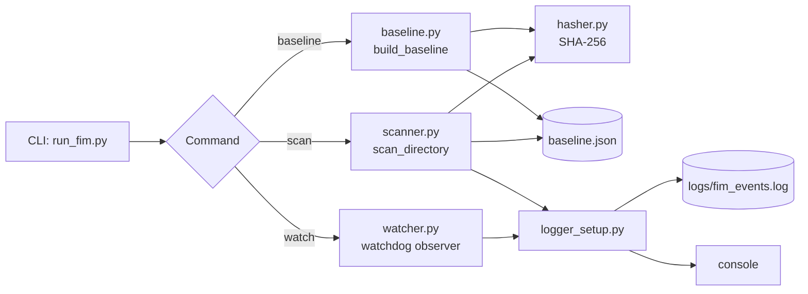

# File Integrity Monitor (FIM)


A command-line tool that detects unauthorized changes to files on disk by comparing SHA-256 hashes against a saved baseline — a simplified version of the same idea behind enterprise tools like Tripwire, OSSEC, and AIDE.

## Overview

File Integrity Monitoring (FIM) is one of the most common host-based defensive security controls: you record a trusted "known good" snapshot of a set of files, then periodically (or continuously) check whether anything has changed. A change might be legitimate — or it might be a sign that a system has been tampered with, a config file was silently altered, or a backdoor was dropped into a directory that shouldn't have new files in it.

This project implements that idea end to end:

1. **`baseline`** — walk a directory, hash every file, save the snapshot.
2. **`scan`** — walk it again, compare against the snapshot, and report anything added, modified, or deleted.
3. **`watch`** — optionally monitor the directory in real time instead of scanning on demand.

## Why I Built This

I'm a BSIT student focusing on cybersecurity, and I wanted my first portfolio project to be something conceptually simple but genuinely useful — not a toy script. FIM is a good starting point because it touches core ideas (hashing for integrity, baselining, drift detection, structured logging) that show up again and again in blue-team tooling, and it doesn't require a lab environment or network access to run safely.

## Features

- **Baseline snapshots** — recursively hashes a directory and stores file hash, size, and modified time as JSON.
- **Drift detection** — classifies every file as unchanged, modified, added, or deleted on each scan.
- **Real-time mode** — optional continuous monitoring using OS-level filesystem events (via `watchdog`), instead of only on-demand scans.
- **Structured logging** — every event is written to a log file in a consistent, greppable format, in addition to the console.
- **Automation-friendly** — exits with status code `1` when changes are detected and `0` when clean, so it can be wired into cron jobs or CI checks.
- **Configurable hash algorithm** — defaults to SHA-256, but supports anything `hashlib` does.
- **Sensible defaults** — automatically excludes `.git`, `__pycache__`, `node_modules`, and virtual environment folders from monitoring.

## Architecture



The core logic (`hasher.py`, `baseline.py`, `scanner.py`) doesn't know anything about the CLI — `cli.py` is a thin layer on top. That separation is also what makes the logic straightforward to unit test (see `tests/test_fim.py`).

## Technologies Used

- **Python 3.8+** — standard library only for the core (`hashlib`, `pathlib`, `argparse`, `logging`, `json`)
- **[watchdog](https://pypi.org/project/watchdog/)** — optional, for real-time filesystem event monitoring
- **[pytest](https://pypi.org/project/pytest/)** — dev-only, for the test suite

## Installation

```bash
git clone https://github.com/<your-username>/file-integrity-monitor.git
cd file-integrity-monitor

# Optional, only needed for `watch` mode:
pip install -r requirements.txt

# Optional, only needed to run the test suite:
pip install -r requirements-dev.txt
```

There's nothing to install for `baseline` and `scan` — they run on the standard library alone.

## Configuration

There's no config file — behavior is controlled entirely through CLI flags:

| Flag | Applies to | Default | Description |
|---|---|---|---|
| `--baseline-file` | `baseline`, `scan` | `baseline.json` | Where the snapshot is saved/read |
| `--algorithm` | `baseline` | `sha256` | Any hash algorithm supported by `hashlib` |
| `--log-dir` | all commands | `logs` | Directory for the event log |
| `--json` | `scan` | off | Also print the full scan result as JSON |

## Usage

```bash
# 1. Create a baseline of the directory you want to protect
python run_fim.py baseline ./sample_target

# 2. Later — or on a schedule — check it for drift
python run_fim.py scan ./sample_target

# 3. Optional: watch it continuously instead of scanning on demand
python run_fim.py watch ./sample_target
```

## Example Output

```
$ python run_fim.py baseline ./sample_target
Baseline created: 2 file(s) tracked.
Saved to: baseline.json

$ python run_fim.py scan ./sample_target

File Integrity Scan Report — 2026-09-02T22:02:26+00:00
Target: /home/user/file-integrity-monitor/sample_target
Unchanged: 2
Added:     0
Modified:  0
Deleted:   0

No changes detected. All monitored files match the baseline.

# ...an incident happens: a config file is edited, a suspicious file
# appears, and another file disappears...

$ python run_fim.py scan ./sample_target

File Integrity Scan Report — 2026-09-02T22:02:26+00:00
Target: /home/user/file-integrity-monitor/sample_target
Unchanged: 0
Added:     1
Modified:  1
Deleted:   1

  [+] .hidden_backdoor.txt
  [~] app_config.txt
  [-] notes.txt

3 change(s) detected. See log for details: logs/fim_events.log
```

(Full captured run, including the log file contents, is in [`examples/example_output.txt`](examples/example_output.txt).)

## Screenshots

This is a CLI tool, so there's no GUI to screenshot — the terminal output above *is* the interface. If you want something visual for the top of this README, consider recording a short terminal session with [asciinema](https://asciinema.org/) or [terminalizer](https://github.com/faressoft/terminalizer) and embedding the resulting clip.

## Running Tests

```bash
pip install -r requirements-dev.txt
pytest tests/ -v
```

12 tests cover hashing determinism, baseline construction (including subdirectories and excluded folders), and every change-detection scenario (added/modified/deleted, and combinations of all three at once).

## Security Considerations

- **The baseline file itself is not tamper-protected.** If an attacker has write access to the monitored directory, they may also be able to overwrite `baseline.json` to hide their tracks by "re-baselining" after making a change. In a real deployment, the baseline should be stored somewhere the monitored system can't write to (a separate host, write-once storage, or at least a signed/hashed copy kept elsewhere).
- **Content and metadata changes are tracked — permission/ownership changes are not.** A file whose contents are untouched but whose permissions were loosened (e.g. `chmod 777`) would currently show as "unchanged."
- **This is an educational project**, intended for use on your own systems or directories you have explicit permission to monitor.

## Limitations

- `scan` is on-demand; only `watch` mode is real-time, and it needs to keep running (no persistence across reboots without wrapping it in something like a `systemd` service or scheduled task).
- Real-time `watch` mode can log more than one `MODIFIED` event for what feels like a single save — this is normal OS-level filesystem event behavior, not a bug in the event handler.
- Hashing very large directories is I/O-bound and single-threaded; there's no multiprocessing yet.
- Only tested on Linux/macOS-style paths.

## Future Improvements

- Sign or HMAC the baseline file so tampering with it is itself detectable.
- Add alerting integrations (email, Slack/webhook) instead of just log + console output.
- Add an ignore-pattern config (regex/glob) for files that legitimately change often.
- Package as a pip-installable CLI (`pyproject.toml` + console-script entry point).
- Track permission/ownership metadata, not just content hash.
- Wrap `watch` mode as a long-running service (systemd unit / Windows service).

## What I Learned

Building this taught me the difference between hashing for *integrity* (SHA-256 here) versus encryption for *confidentiality* — they solve different problems and it's easy to conflate them early on. It also made the trade-off between polling and real-time monitoring concrete: on-demand scanning is simple and stateless but can miss the exact moment something happened, while `watchdog`'s real-time events are immediate but need a long-running process and produce noisier output. Writing the tests also caught an edge case I hadn't thought through up front — what happens when a file becomes unreadable *during* a scan — which is now handled explicitly instead of crashing.

*(This section is worth writing in your own words before this goes on your GitHub — it's the part an interviewer is most likely to ask you to expand on.)*

## Project Structure

```
file-integrity-monitor/
├── README.md
├── LICENSE
├── requirements.txt
├── requirements-dev.txt
├── .gitignore
├── run_fim.py              # Entry point
├── fim/
│   ├── __init__.py
│   ├── cli.py               # Argument parsing + command wiring
│   ├── hasher.py             # SHA-256 (or other) file hashing
│   ├── baseline.py           # Build/save/load the baseline snapshot
│   ├── scanner.py            # Diff current state vs. baseline
│   ├── watcher.py            # Real-time monitoring (watchdog)
│   └── logger_setup.py       # Structured console + file logging
├── tests/
│   └── test_fim.py           # 12 unit tests
├── sample_target/            # Demo directory to try the tool on
│   ├── app_config.txt
│   └── notes.txt
└── examples/
    └── example_output.txt    # Full captured example run
```

## Author

**[Your Name]**
[your.email@example.com] · [GitHub](https://github.com/<your-username>) · [LinkedIn](https://linkedin.com/in/<your-profile>)

## License

This project is licensed under the MIT License — see [LICENSE](LICENSE) for details.
